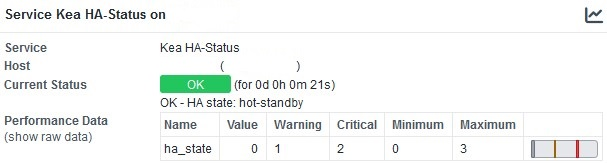
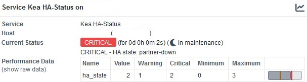

# check_kea_ha_status

A simple Nagios Plugin to monitor the high-availability status of Kea dhcp4 service.


### Description

This script monitors the HA status of the Kea dhcp4 service.


### Dependencies

- Python 3
- requests installed via pip
- OMD, Check_MK or other Monitoring solutions
- HA hook enabled in your Kea setup (libdhcp_ha.so)


### Tested on the following systems

- OMD 5.0 (Ubuntu 22) with Python 3.10
- Kea 2.2.0 (Ubuntu 22) in mode hot-standby


### Installation

Copying it to your local plugin folder should be enough


### Usage

python3 check_kea_ha_status.py Ipv4OfKeaServer PortOfKeaApi
python3 check_kea_ha_status.py 10.1.1.1 8080


### OMD command and service definition

The command and service definitions for OMD should look something like this:

````
define command {
  command_name                   check_kea_ha_status
  command_line                   python3 $USER5$/check_kea_ha_status.py $HOSTADDRESS$ $ARG1$
}

define service {
  service_description            Kea HA-Status
  host_name                      hostname_kea
  use                            service-template-interval-2min
  check_command                  check_kea_ha_status!8080
}

````


### Output






### License

This project is licensed under the GNU General Public License v3.0 License - see the LICENSE.md file for details
